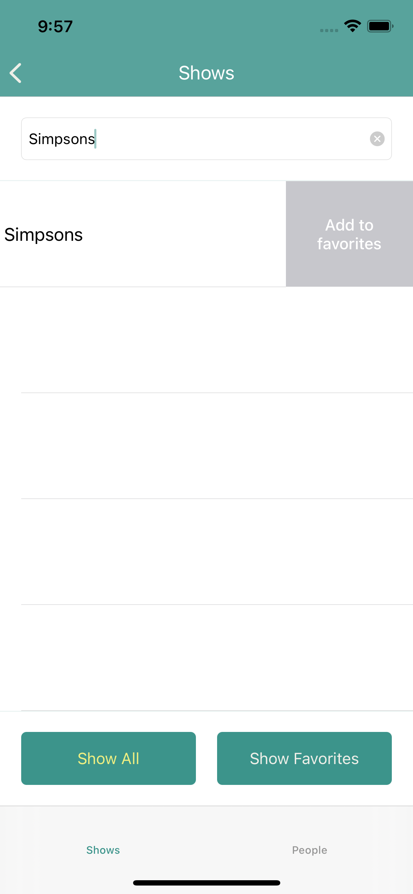

# TVMaze

TVMaze is an iOS 13+ application that lists TV series using the API provided by the TVMaze website. 
The project demonstrates the use of MVVM (UIKit + RXSwift) + Clean architecture.

I have reused a couple of important base classes and concepts that I have picked up from colleagues over the last few years - their names are still visible in the corresponding files.

## Requirements

Xcode
```bash
http://apple.cm/xcode
```

CocoaPods
```bash
https://guides.cocoapods.org/using/getting-started.html
```
## Installation

Clone the repository.

```bash
git clone https://github.com/adamteampudu/tvmaze
cd tvmaze
pod install
```

Then open the TVMaze.xcworkspace file.

## Features achieved

* List all of the series contained in the API used by the paging scheme provided by the API. 
* Allow users to search series by name. 
* The listing and search views must show at least the name and poster image of the series. 
* After clicking on a series, the application should show the details of the series, showing the following information: 
* Name 
* Poster 
* Days and time during which the series airs 
* Genres 
* Summary 
* List of episodes separated by season

After clicking on an episode, the application should show the episode’s information, including: 
* Name 
* Number 
* Season 
* Summary 
* Image, if there is one 

* Allow the user to save a series as a favorite. 
* Allow the user to delete a series from the favorites list. 
* Allow the user to browse their favorite series in alphabetical order, and click on one to see its details. 
* Create a people search by listing the name and image of the person. 
* After clicking on a person, the application should show the details of that person, such as Name, Image and Series they have participated in, with a link to the series details. 

## Features not achieved
* Allow the user to set a PIN number to secure the application and prevent unauthorized users. 
* For supported phones, the user must be able to choose if they want to enable fingerprint authentication to avoid typing the PIN number while opening the app. 


## Frameworks used
* SDWebImage - for image caching
* SwiftGen - automatic code generation for Asset/images/strings
* Swinject - for dependency injectio
* RXSwift + RXCocoa - for reactive programming
* Cuckoo - for mocking in unit tests
* Alamofire - networking





